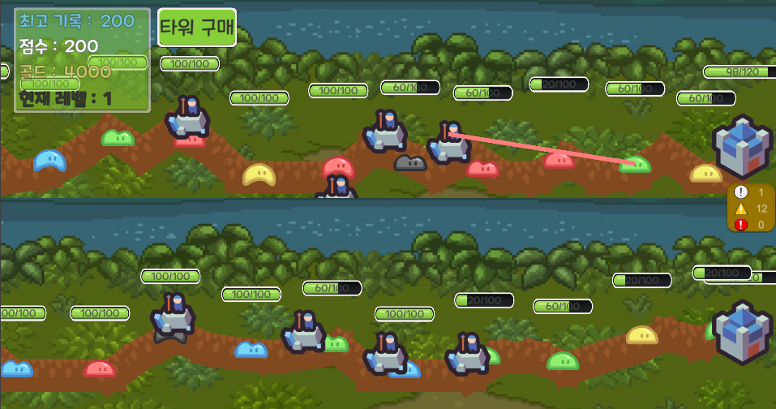
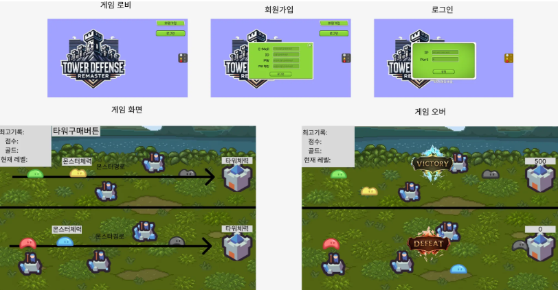
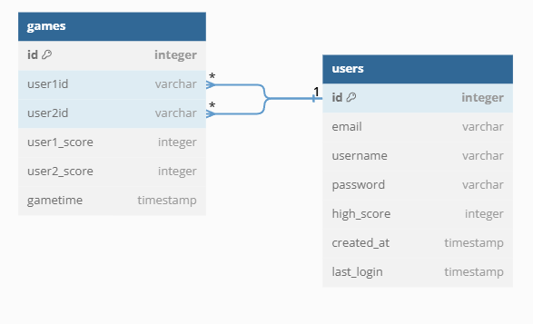

# 멀티플레이 게임서버

### 프로젝트 소개

tcp를 이용하여 멀티플레이 게임 서버를 구현하는 프로젝트입니다.



### 디렉토리 구조

```
📦src
 ┣ 📂classes
 ┃ ┗ 📂models
 ┃ ┃ ┣ 📜base.class.js
 ┃ ┃ ┣ 📜client.class.js
 ┃ ┃ ┣ 📜game.class.js
 ┃ ┃ ┣ 📜monster.class.js
 ┃ ┃ ┣ 📜tower.class.js
 ┃ ┃ ┗ 📜user.class.js
 ┣ 📂config
 ┃ ┗ 📜config.js
 ┣ 📂constants
 ┃ ┣ 📜env.js
 ┃ ┗ 📜header.js
 ┣ 📂db
 ┃ ┣ 📂games
 ┃ ┃ ┣ 📜game.db.js
 ┃ ┃ ┗ 📜game.queries.js
 ┃ ┣ 📂migrations
 ┃ ┃ ┗ 📜createSchema.js
 ┃ ┣ 📂sql
 ┃ ┃ ┣ 📜games_db.sql
 ┃ ┃ ┗ 📜users_db.sql
 ┃ ┣ 📂users
 ┃ ┃ ┣ 📜user.db.js
 ┃ ┃ ┗ 📜user.queries.js
 ┃ ┣ 📜database.js
 ┃ ┗ 📜index.js
 ┣ 📂events
 ┃ ┣ 📜onConnection.js
 ┃ ┣ 📜onData.js
 ┃ ┣ 📜onEnd.js
 ┃ ┗ 📜onError.js
 ┣ 📂handlers
 ┃ ┣ 📂game
 ┃ ┃ ┣ 📜match.handler.js
 ┃ ┃ ┣ 📜monster.baseattack.js
 ┃ ┃ ┣ 📜monsterDeath.handler.js
 ┃ ┃ ┗ 📜spawMonster.handler.js
 ┃ ┣ 📂tower
 ┃ ┃ ┣ 📜towerAttack.handler.js
 ┃ ┃ ┗ 📜towerPurchase.handler.js
 ┃ ┣ 📂user
 ┃ ┃ ┣ 📜login.handler.js
 ┃ ┃ ┗ 📜register.handler.js
 ┃ ┗ 📜index.js
 ┣ 📂init
 ┃ ┣ 📜index.js
 ┃ ┗ 📜loadProto.js
 ┣ 📂protobuf
 ┃ ┣ 📜packetName.js
 ┃ ┗ 📜protobuf.proto
 ┣ 📂sessions
 ┃ ┣ 📜client.session.js
 ┃ ┣ 📜game.session.js
 ┃ ┣ 📜sessions.js
 ┃ ┗ 📜user.session.js
 ┣ 📂utils
 ┃ ┣ 📂error
 ┃ ┃ ┣ 📜customError.js
 ┃ ┃ ┗ 📜errorHandler.js
 ┃ ┣ 📂notification
 ┃ ┃ ┣ 📜game.notification.js
 ┃ ┃ ┣ 📜notificationPoroto.js
 ┃ ┃ ┗ 📜tower.notification.js
 ┃ ┣ 📂parser
 ┃ ┃ ┗ 📜packetParser.js
 ┃ ┣ 📂response
 ┃ ┃ ┣ 📜createHeader.js
 ┃ ┃ ┣ 📜createRespose.js
 ┃ ┃ ┗ 📜responseProto.js
 ┃ ┣ 📜dateFormatter.js
 ┃ ┗ 📜transformCase.js
 ┗ 📜server.js
```

### 와이어 프레임



### ERD



### 패킷구조

전체 패킷 명세

| 필드 명       | 타입   | 설명                  |
| ------------- | ------ | --------------------- |
| packetType    | ushort | 패킷 타입 (2바이트)   |
| versionLength | ubyte  | 버전 길이 (1바이트)   |
| version       | string | 버전 (문자열)         |
| sequence      | uint32 | 패킷 번호 (4바이트)   |
| payloadLength | uint32 | 데이터 길이 (4바이트) |
| payload       | bytes  | 실제 데이터           |

#### 게임 데이터 명세

Position
| 필드 명 | 타입 | 설명 |
| ------- | ----- | --------------- |
| x | float | 위치값 x |
| y | float | 위치값 y |

BaseData
| 필드 명 | 타입 | 설명 |
| ------- | ----- | --------------- |
| hp | int32 | base 체력 |
| maxHp | int32 | base 최대 체력 |

TowerData
| 필드 명 | 타입 | 설명 |
| ------- | ----- | --------------- |
| towerId | int32 | 타워 id(고유한 값) |
| x | float | 타워 위치 x |
| y | float | 타워 위치 y |

MonsterData
| 필드 명 | 타입 | 설명 |
| ------- | ----- | --------------- |
| monsterId | int32 | 몬스터 id(고유한 값) |
| monsterNumber | int32 | 몬스터 타입(1 ~ 5) |
| level | int32 | 몬스터 레벨 |

InitialGameState
| 필드 명 | 타입 | 설명 |
| ------- | ----- | --------------- |
| baseHp | int32 | 초기 베이스 체력 |
| towerCost | int32 | 타워 설치 비용 |
| initialGold | int32 | 시작 골드 |
| monsterSpawnInterval | int32 | 몬스터 생성 주기 |

GameState
| 필드 명 | 타입 | 설명 |
| ------- | ----- | --------------- |
| gold | int32 | 골드 |
| base | BaseData | 베이스 정보 |
| highScore | int32 | 최고 점수 |
| towers | repeated TowerData | 타워 정보들 |
| monsters | repeated MonsterData | 몬스터 정보들 |
| monsterLevel | int32 | 몬스터 레벨 |
| score | int32 | 현재 점수 |
| monsterPath | repeated Position | 몬스터 경로 위치 |
| basePosition | Position | 베이스 생성 위치 |

#### 실패 코드

```
enum GlobalFailCode {
    NONE = 0;
    UNKNOWN_ERROR = 1;
    INVALID_REQUEST = 2;
    AUTHENTICATION_FAILED = 3;
}
```

#### 패킷 명세

C2SRegisterRequest
| 필드 명 | 타입 | 설명 |
| ------- | ----- | --------------- |
| id | string | id(회원가입에 입력한 값) |
| password | string | 비밀번호 |
| email | string | 이메일 |

S2CRegisterResponse
| 필드 명 | 타입 | 설명 |
| ------- | ----- | --------------- |
| success | bool | 회원가입 성공여부 |
| message | string | 메세지 |
| failCode | GlobalFailCode | 실패코드 |

C2SLoginRequest
| 필드 명 | 타입 | 설명 |
| ------- | ----- | --------------- |
| id | string | 로그인 id |
| password | string | 비밀번호 |

S2CLoginResponse
| 필드 명 | 타입 | 설명 |
| ------- | ----- | --------------- |
| success | bool | 로그인 성공여부 |
| message | string | 메세지 |
| token | string | 토큰(jwt) |
| failCode | GlobalFailCode | 실패코드 |

C2SMatchRequest
| 필드 명 | 타입 | 설명 |
| ------- | ----- | --------------- |
| | | 매치 요청 |

S2CMatchStartNotification
| 필드 명 | 타입 | 설명 |
| ------- | ----- | --------------- |
| initialGameState | InitialGameState | 게임 초기값 |
| playerData | GameState | 현재 유저 정보 |
| opponentData | GameState | 상대 유저 정보 |

S2CStateSyncNotification(상태 동기화)
| 필드 명 | 타입 | 설명 |
| ------- | ----- | --------------- |
| userGold | int32 | 현재 골드 |
| baseHp | int32 | 현재 베이스 체력 |
| monsterLevel | int32 | 현재 몬스터 레벨 |
| score | int32 | 현재 점수 |
| towers | repeated TowerData| 현재 타워 정보들 |
| monsters | repeated MonsterData | 현재 몬스터 정보들 |

C2STowerPurchaseRequest
| 필드 명 | 타입 | 설명 |
| ------- | ----- | --------------- |
| x | float | 생성한 타워 위치 값 x |
| y | float | 생성한 타워 위치 값 y |

S2CTowerPurchaseResponse
| 필드 명 | 타입 | 설명 |
| ------- | ----- | --------------- |
| towerId | int32 | 생성한 타워의 id |

S2CAddEnemyTowerNotification(생성한 타워 정보를 상대에게 알려줄 패킷 구조)
| 필드 명 | 타입 | 설명 |
| ------- | ----- | --------------- |
| towerId | int32 | 생성한 타워 id |
| x | float | 타워 위치 x |
| y | float | 타워 위치 y |

C2SSpawnMonsterRequest
| 필드 명 | 타입 | 설명 |
| ------- | ----- | --------------- |
| | | 몬스터 생성 요청 |

S2CSpawnMonsterResponse
| 필드 명 | 타입 | 설명 |
| ------- | ----- | --------------- |
| monsterId | int32 | 생선한 몬스터 id |
| monsterNumber | int32 | 몬스터 타입(1 ~ 5) |

S2CSpawnEnemyMonsterNotification(생성한 몬스터 정보를 상대에게 알려줄 패킷 구조)
| 필드 명 | 타입 | 설명 |
| ------- | ----- | --------------- |
| monsterId | int32 | 생선한 몬스터 id |
| monsterNumber | int32 | 몬스터 타입(1 ~ 5) |

C2STowerAttackRequest
| 필드 명 | 타입 | 설명 |
| ------- | ----- | --------------- |
| towerId | int32 | 공격한 타워 id |
| monsterId | int32 | 공격 당한 몬스터 id |

S2CEnemyTowerAttackNotification(공격한 정보를 상대에게 알려줄 패킷 구조)
| 필드 명 | 타입 | 설명 |
| ------- | ----- | --------------- |
| towerId | int32 | 공격한 타워 id |
| monsterId | int32 | 공격 당한 몬스터 id |

C2SMonsterAttackBaseRequest
| 필드 명 | 타입 | 설명 |
| ------- | ----- | --------------- |
| damage | int32 | 베이스가 입은 데미지 |

S2CUpdateBaseHPNotification(베이스 체력 정보를 알려줄 패킷 구조)
| 필드 명 | 타입 | 설명 |
| ------- | ----- | --------------- |
| isOpponent | bool | 현재 유저 인지 상대 유저인지 선택 유무 |
| baseHp | int32 | 베이스 체력 |

S2CGameOverNotification
| 필드 명 | 타입 | 설명 |
| ------- | ----- | --------------- |
| isWin | bool | 승패 유무 |

C2SGameEndRequest
| 필드 명 | 타입 | 설명 |
| ------- | ----- | --------------- |
| | | 게임 종료 요청 |

C2SMonsterDeathNotification
| 필드 명 | 타입 | 설명 |
| ------- | ----- | --------------- |
| monsterId | int32 | 처치된 몬스터 id |

S2CEnemyMonsterDeathNotification(처치된 몬스터 정보를 상대에게 알려줄 패킷 구조)
| 필드 명 | 타입 | 설명 |
| ------- | ----- | --------------- |
| monsterId | int32 | 죽은 몬스터 id |

#### 최상위 패킷 메세지

GamePacket
| 필드 명 | 타입 | 설명 |
| ------- | ----- | --------------- |
| payload | oneof | 실제 데이터 |

payload
| 필드 명 | 타입 | 설명 |
| ------- | ----- | --------------- |
| 회원가입 & 로그인 |
| registerRequest | C2SRegisterRequest | 회원가입 요청 (클라) |
| registerResponse | S2CRegisterResponse | 회원가입 응답 (서버) |
| loginRequest | C2SLoginRequest | 로그인 요청 (클라) |
| loginResponse | S2CLoginResponse | 로그인 응답 (서버) |
| 매칭 |
| matchRequest | C2SMatchRequest | 매치 요청(클라 게임 시작) |
| matchStartNotification | S2CMatchStartNotification | 매칭 응답(서버) |
| 상태 동기화 |
| stateSyncNotification | S2CStateSyncNotification | 상태 동기화(서버) |
| 타워 구입 및 배치 |
| C2STowerPurchaseRequest | towerPurchaseRequest | 타워 구입 요청(클라) |
| S2CTowerPurchaseResponse | towerPurchaseResponse | 타워 구입 응답(서버) |
| S2CAddEnemyTowerNotification | addEnemyTowerNotification | 타워 구입 응답(서버 다른 유저에게) |
| 몬스터 생성 |
| spawnMonsterRequest | C2SSpawnMonsterRequest | 몬스터 생성 요청(클라) |
| spawnMonsterResponse | S2CSpawnMonsterResponse | 몬스터 생성 응답(서버) |
| spawnEnemyMonsterNotification | S2CSpawnEnemyMonsterNotification | 몬스터 생성 응답(서버 다른 유저에게) |
| 전투 액션 |
| towerAttackRequest | C2STowerAttackRequest | 타워 공격 요청(클라) |
| enemyTowerAttackNotification | S2CEnemyTowerAttackNotification | 타워 공격 상황 전달(서버 다른 유저에게) |
| monsterAttackBaseRequest | C2SMonsterAttackBaseRequest | 몬스터 기지 공격 요청(클라) |
| 기지 HP 업데이트 및 게임 오버 |
| updateBaseHpNotification | S2CUpdateBaseHPNotification | 기지 체력 정보(서버) |
| gameOverNotification | S2CGameOverNotification | 게임 종료 정보(서버) |
| 게임 종료 |
| gameEndRequest | C2SGameEndRequest | 게임 종료 응답(클라) |
| 몬스터 사망 통지 |
| monsterDeathNotification | C2SMonsterDeathNotification | 몬스터 사망 요청(클라) |
| enemyMonsterDeathNotification | S2CEnemyMonsterDeathNotification | 몬스터 사망 정보(서버 다른 유저에게) |
